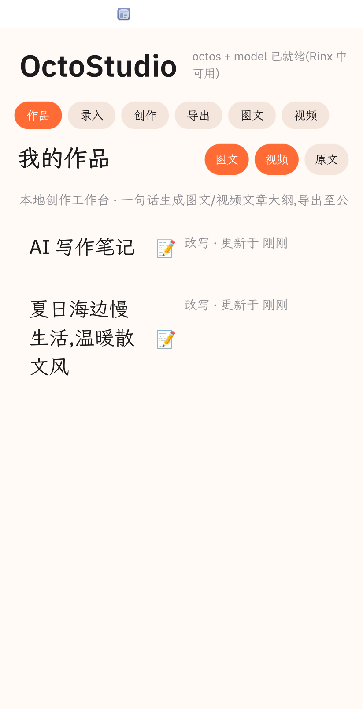
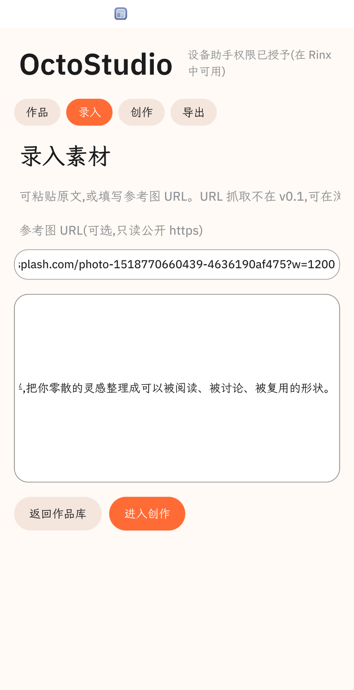
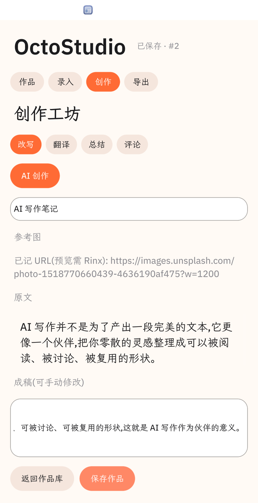
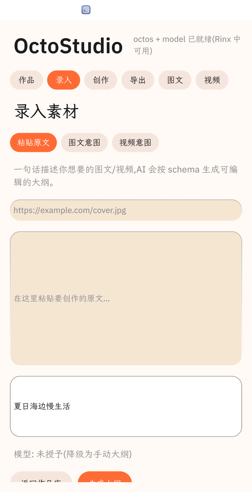
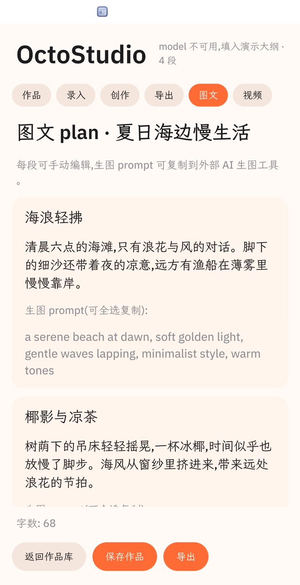
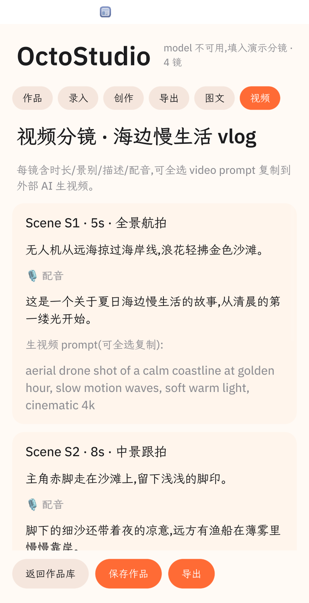
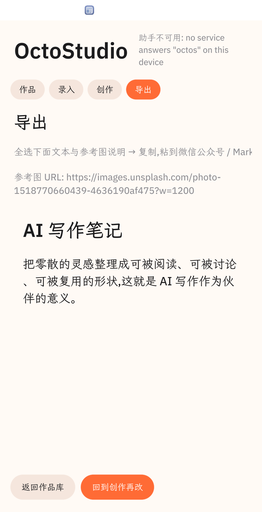
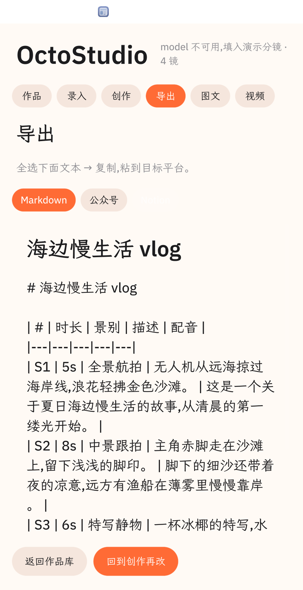

# OctoStudio

> **言出法随 · 意图即应用 — 一句话,就是一篇文**



一句话,就是一篇文。

OctoStudio 让创作者的意图直接成为产物 — **言出法随,意图即应用**。跑在 [OctoSense](https://github.com/OctoSense-org) 设备上的脚本应用,整个 `bundle/` 就是一个 `main.splash` 文件,在隔离沙箱里被 Splash VM 解释执行。面向中文内容创作者(公众号作者 / Markdown 写作者 / 视频脚本写手):用一句话或一段原文,生成可发布到多个平台的内容,作品全部存在你设备本地,AI 用的是你设备上的模型而非云端 API。

`v0.2.0` · 736 行 Splash · 6 屏 · 8 张真实截图 · Apache-2.0

---

## 这是什么

OctoStudio 是给 **中文内容创作者** 用的本地优先、AI 增强的创作工作台。它把"从一段原文 / 一句话意图 → 可发布到多平台"这条链做成一键流程,跑在 Rinx / OctoSense 设备上 — 作品存设备沙箱,跨设备不离开你的控制,调用的是用户设备上的 AI(密钥由 AI providers 系统应用托管)。

## 痛点 — 创作者面对的真问题

1. **多平台分发繁琐**:同一篇文章要粘到公众号后台、Markdown 编辑器、Notion,每次都重新调格式
2. **AI 改写生硬**:通用模型改出来"风格统一",但跟你自己的语气对不上,改完还得手动润色
3. **视频脚本难起手**:从一句话想法到分镜表,中间缺一座桥
4. **每次都得手写**:参考资料管理、版本管理、风格管理都靠脑子记,工具散在剪贴板 / 网盘 / 浏览器收藏夹

OctoStudio 把这四件事压缩到一台设备上的一个 app 里。

## 意境 — 言出法随,意图即应用

OctoStudio 的两条产品意境,贯穿所有屏幕、所有交互、所有降级路径。它们不是营销话术,而是驱动每行代码的底层信条:

### 言出法随

> **说出口的话,就是可发布的法(范式)。**

在传统工具里,创作者要先想好"用哪个模板、哪种风格、几号字体",再点十几个按钮才能产出一篇文。OctoStudio 反过来:**用户的输入即产物**。说一句"夏日海边慢生活,温暖散文风",图文 plan 立即落地;说一句"3 分钟产品发布会开场,极简风",视频分镜立即落地。说出口的话不打折、不被工具改写、不需要用户再做"翻译"。

### 意图即应用

> **用户的意图本身就是应用;不需要"配置应用"这一步。**

意图驱动一切:Compose 屏从输入意图 → `model.complete` 按 schema 出 plan → Export 屏多格式呈现,中间没有"打开模板"或"切换工作流"这类配置。**意图是输入,产物是输出,中间只有 AI 的创造性填充**。

### 两境相生

- **"言出法随"** 讲的是用户感受 — 说出口的话立刻成为可发布的产物,中间没有摩擦。
- **"意图即应用"** 讲的是产品形态 — 应用跟着意图走,意图是唯一的输入参数。
- 两条意境同时成立,OctoStudio 才完整:少一条就掉进"AI 玩具"(只生成不可用)或"传统工具"(只能配置不能意图)的旧范式里。

## 它做什么

| # | 能力 | 用到的平台能力 | 截图 |
|---|---|---|---|
| 1 | **原文改写 / 翻译 / 总结 / 评论** — 粘贴一段原文,选风格,AI 出成稿 | `octos.turn.start` | [`03-studio.png`](bundle/screenshots/03-studio.png) |
| 2 | **一句话生成图文文章大纲** — 输入主题,AI 按 schema 出标题 + 摘要 + 4 段正文 + 每段英文生图 prompt | `model.complete` + `images` | [`06-intent-compose.png`](bundle/screenshots/06-intent-compose.png) → [`07-intent-article.png`](bundle/screenshots/07-intent-article.png) |
| 3 | **一句话生成视频分镜脚本** — 同上,出场景表(时长 / 景别 / 描述 / 配音 / 生视频 prompt) | `model.complete` | [`08-intent-video.png`](bundle/screenshots/08-intent-video.png) |
| 4 | **多格式导出** — Markdown / 公众号 / Notion 三种格式,一键全选复制 | 纯文本转换 | [`04-export.png`](bundle/screenshots/04-export.png) / [`09-export-formats.png`](bundle/screenshots/09-export-formats.png) |
| 5 | **本地作品库** + 字数统计 + 相对时间 + 长按删除,全部存设备沙箱 | `storage` | [`01-home.png`](bundle/screenshots/01-home.png) |
| 6 | **降级完备** — 任何 AI 服务不可用,UI 仍可手动创作并保存,失败路径明示 | `host.has()` 探测 + 预置 demo 数据 | [`02-compose.png`](bundle/screenshots/02-compose.png) |
| 7 | **意图生成动画** *(规划中)* — 用户点 `生成大纲` 时,AI 生成过程中显示等待动画(进度流光 / 骨架屏 / 微动效),让"等待"不焦虑 | Splash 局部动画 + 状态指示 | 规划中 |
| 8 | **宣传片** *(规划中)* — 基于 8 张真机截图剪成的 15–30 秒演示视频,用于初赛路演、赛后社交传播与商店展示 | `tools/octo shot` 时序截图 + 后期剪辑 | 规划中 |
| 9 | **宣传图** *(规划中)* — 基于 README 截图与设计理念的横版宣传海报(1920×1080 / 1080×1920),商店展示与社媒传播 | 平面设计 + AI 生图 | 规划中 |

未来规划(见 [`ROADMAP.md`](ROADMAP.md)):

- **个人风格工坊**(v0.3.0)— 粘贴 3–5 篇自己文章,应用分析风格指纹,新建作品可选"按我的风格写"
- **主题网络抓取**(v0.3.0)— 用户给主题词,应用从公开数据源拉素材,带来源记录
- **拟人化文章生成**(v0.4.0)— 选定主题素材 + 风格 → 一键生成仿个人风格文章
- **意图生成动画 + 宣传片 + 宣传图**(v0.3.0)— 应用内等待动效 + 初赛 / 赛后传播物料

## 5 分钟走一遍

1. **打开作品库** — 看两张已有作品 + 顶部 3 个新建按钮:`图文 / 视频 / 原文`

   

2. **粘贴原文走经典改写** — 点 `原文`,粘一段中文,进 Studio,选"翻译"风格,点 `AI 创作`,成稿直接落在输入框里,可继续手动改

   

3. **改写与重试** — Studio 屏顶有 4 个风格按钮 + AI 创作 / 重试;AI 不可用时 `重试` 按钮仍可用,UI 继续可手动创作

   

4. **一句话生成图文 plan** — 回到 Compose,选 `图文意图` chip,输入"夏日海边慢生活",点 `生成大纲`,图文 plan(标题 + 摘要 + 4 段正文 + 每段英文生图 prompt)落在 `图文 plan · ` 屏,prompt 可全选复制到外部 AI 生图工具

   

   

5. **一句话生成视频分镜** — 同上,选 `视频意图`,AI 出 4–6 镜(时长 / 景别 / 描述 / 配音 / 生视频 prompt)

   

6. **导出到目标平台** — 切到 Export 屏,选 `Markdown / 公众号 / Notion` 三种格式,全选文本 → 复制 → 粘贴到公众号后台 / Notion / Markdown 编辑器

   

   

## 设计理念

> **言出法随 · 意图即应用** — 一句话即产物,意图即路径。

五条核心信念,贯穿所有屏幕:

1. **言出法随** — 用户输入与产物之间不留缝隙;一切交互以"一句话达成"为标尺。
2. **意图即应用** — 应用形态由意图驱动,不提供"配置应用"的中间层;AI 是意图的创造性填充。
3. **本地优先** — 作品存设备沙箱,跨设备同步靠 OctoSense 而非云端账号;**无密钥 / 无 token / 无账号注册**。
4. **平台原生 AI** — 在 Rinx / OctoSense 设备上调用宿主 AI(`octos.*` + `model`),用户密钥由 AI providers 系统应用托管,应用本身看不到模型 id 或 API key。
5. **透明降级 + 多格式出口** — AI 不可用时 UI 仍可手动创作并保存,失败原因原样显示;创作链的最后一站对接到真实发布平台(公众号 / Markdown / Notion)。

## 平台能力

OctoStudio 用到的 OctoSense 平台能力(声明在 `bundle/manifest.json`):

| 能力 | 角色 | 落在哪些屏幕 |
|---|---|---|
| `octos.session.open / octos.turn.start` | 设备 AI peer,改写 / 翻译 / 总结 / 评论 | Studio 屏 `AI 创作` |
| `model.complete` | 一次性、按 schema 校验的模型调用;意图创作 + 未来风格分析 / 拟人化写作的主路径 | Compose 屏 `生成大纲` |
| `images` | 显示参考图(`https://`,只读) | Studio 屏参考图区域 |
| `web` | 打开公开 https 网页(预留,本 v0.2 未主动调用) | — |
| `storage` | 作品库落盘 | 所有屏 |

应用本身不持有任何密钥或 token,所有 AI 请求由宿主服务代理。

## 不做什么

**平台红线(永不做)**:

- 不申请 `llm / news / mail / profile`(仅系统应用可用,商店申请必拒)
- 不收集密码 / PIN / 一次性码
- `network.hosts` 保持空数组,所有 https 资源走 `images`(公开域)或用户回填的 URL;`net` capability 本 v0.2 不申请
- 不写 `os.*` id(这是商店应用,不是系统应用)
- 不在 bundle 中放 token / API key / 私钥

**v0.2 不做(规划中)**:

- 应用内一键生图 / 生视频 — 平台 `octos.*` / `model.*` 当前无 image / video output,等 OctoSense 扩展
- 视频预览 / 播放 — SCRIPT-API 当前无 video widget,等 `OctoScript-Makepad` 跟进
- 一键发公众号 — 凭据不入包,保持"复制粘贴到后台"的克制设计

**降级路径(明示)**:

- `card-host` / 旧 App Hub pin 不提供 `octos.*` / `model`:UI 全程可手动创作并保存,所有 AI 失败显示 `no service answers "<svc>" on this device` 原文
- `model` 不可用时,意图创作填入预置 demo 大纲 + 状态栏写 `model 不可用,填入演示大纲`
- 微信 OAuth / secret:不接,人到后台粘贴

## 接下来

完整迭代路线见 [`ROADMAP.md`](ROADMAP.md)。当前状态:

| 里程碑 | 版本 | 状态 |
|---|---|---|
| M0 / M1 意图创作 + 多格式导出 | v0.2.0 | ✅ 已落地 |
| M2 创作者工作流补齐(字数 / 删除 / 多格式 / 重试 / 相对时间) | v0.2.x | 部分落地 |
| M3 个人风格工坊 + 主题网络抓取 + **意图生成动画 + 宣传片 + 宣传图** | v0.3.0 | 规划中 |
| M4 `model.complete` 高阶用法(起标题 / 摘要 / 关键词提取) | v0.4.0 | 规划中 |
| M5 拟人化文章生成 | v0.4.0 | 规划中 |
| M6 glance 卡片(发布到 glance 屏) | v0.5.0 | 规划中 |
| M7 等平台(视频 widget / 触发器 / toolbox-peers / `sys.digest`) | — | 等 OctoSense |

---

## 寄语

> **言出法随,意图即应用。**
>
> 愿每一个写作者,开口即成文。
> 愿每一个意图,落地即产物。

# 给开发者

下面这一节是给协作者看的 — 怎么把工具链跑起来、怎么改 `main.splash`、怎么发版。初赛评审可跳过。

## 前置条件

按 [`OctoScript-App-Design-Flow/README.zh-CN.md`](https://github.com/OctoSense-org/OctoScript-App-Design-Flow/blob/main/README.zh-CN.md) 的快速上手:

| 工具 | 版本 | 备注 |
| --- | --- | --- |
| macOS(Apple silicon 已验证) | 14+ | Windows / Linux 未验证 |
| Rust(stable via rustup) | `~/.cargo/bin` 加入 PATH | 用来构建 `hub` 与 `card-host` |
| Python | 3.9+ | macOS 自带的 `/usr/bin/python3` 即可 |
| 图形会话 | — | card-host 会开一个 412×892 点的窗口 |

工作区布局 — 五个仓库并排放置:

```text
<workspace>/
├── OctoScript-App-Design-Flow/   # 工具链入口
├── OctoSense-App-Hub/            # hub、card-host 的 Cargo workspace
├── makepad/                      # 框架
├── octoscript-makepad/           # Splash + widgets
└── octoscript/                   # 语言运行时
```

本项目 (`octostudio/`) 是第六个目录,在工作区外面随便放哪里都行,不在依赖图中。

## 一次性构建工具链

进入工作区,从 `OctoSense-App-Hub` 编译两个二进制(总产物约 1 GB,首次约 1 分钟):

```sh
cd <workspace>
git clone https://github.com/OctoSense-org/OctoScript-App-Design-Flow.git
git clone https://github.com/OctoSense-org/OctoSense-App-Hub.git
cd OctoScript-App-Design-Flow && python3 tools/setup-native.py

# 这一步会拉 makepad / octoscript / octoscript-makepad 三个仓库并锁定到
# native-runtime.lock.json 指定的 commit。可重复跑、幂等。
(cd ../OctoSense-App-Hub && cargo build --release -p octosense-card-host -p octosense-app-hub)

tools/octo doctor    # 应该全部 [ok]
```

> 产物路径:`$CARGO_TARGET_DIR/release/{hub,card-host}`,默认会找到。如果你的 CARGO_TARGET_DIR 不一样,设置 `OCTO_HUB=/path/to/hub` / `OCTO_CARD_HOST=/path/to/card-host` 即可。

## 仓库结构

```text
octostudio/
├── README.md                ← 你正在读
├── BRIEF.md                 设计意图
├── REVIEW-ANSWERS.md        答 hub scan 7 个审核问题
├── ROADMAP.md               迭代路线
├── build/                   hub scan packet(不进 git)
├── bundle/                  ★ THE SUBMISSION
│   ├── manifest.json        id、name、version、capabilities、hosts、integrity
│   ├── listing.json         商店展示的元数据
│   ├── main.splash          程序本体(736 行,Splash 脚本)
│   ├── assets/icon.svg      列表上的图标
│   └── screenshots/         8 张真实截图(01 / 02 / 03 / 04 / 06 / 07 / 08 / 09)
├── AGENTS.md  CLAUDE.md  GEMINI.md   Agent 规则(从模板复制,不提交)
├── .gitignore               忽略 build/ / target/ / .local-state/ / *.key
└── .local-state/            card-host 的 jail + log(本地调试用,不提交)
```

**`main.splash` 本身就是程序**。它不是配置文件,没有 .py / .rs / .ts 配套。整个应用是一个被 Splash VM 解释执行的脚本应用,顶层 `let` 是状态、`fn` 是函数,然后一个根 View。

## 看到页面 — 三种模式

### 模式 1:Agent / 脚本驱动(无头,推荐)

```sh
cd /Users/lijing/CodeProjects/OctoScript-App-Design-Flow
tools/octo run /Users/lijing/CodeProjects/octostudio/bundle \
    --port 8142 --hidden --detach

# 输出示例:
#   card-host: octostudio 0.2.0 admitted — capabilities {…}
#   ready: first frame drawn
#   pid 81880  log /Users/lijing/CodeProjects/octostudio/.local-state/card-host.log
```

`--hidden` 让 card-host 不开窗口、不抢焦点,远程控制桥 (`/snap`, `/click`, `/g` 截图) 照常工作。**你可以同时跑多个应用、多个端口,互不抢屏幕。**

远程控制桥路由(均为 GET,坐标是窗口 CSS 点,y 向下):

| 路由 | 作用 |
| --- | --- |
| `/snap?q=…` | 组件矩形 + 文本,例如 `/snap?q=AI` |
| `/d` | 整棵组件树的文本形式 |
| `/click?x=&y=&wait=1` | 一次真实点击(坐标是 CSS 点,824×1606 的截图对应 412×803) |
| `/t?t=TEXT&wait=1` | 向获得焦点的输入框输入文字 |
| `/k?k=down&c=ReturnKey` | 一个按键事件 |
| `/log?n=50` | 最近的日志行 |
| `/g?raw=1` | 窗口的 PNG(就是 `tools/octo shot` 保存的内容) |
| `/quit`(或 `/gq`) | 退出 — **最后一定要调用** |

完成后:

```sh
curl -s 127.0.0.1:8142/quit
```

### 模式 2:肉眼可见窗口(交互调试)

去掉 `--hidden`,card-host 会弹一个 412×892 点的窗口,你直接点。

```sh
tools/octo run /Users/lijing/CodeProjects/octostudio/bundle --port 8142
# 窗口出现,你能看见、能点
# Ctrl+C 退出
```

`--detach` 在 macOS 上仍会让窗口出现,但 fork 到后台不会卡你的 shell。

### 模式 3:在 OctoSense Shell 里看(发布前的真实路径)

`card-host` 是参考实现。真实运行环境是 OctoSense 桌面端 Shell 和手机 Home 端,通过 App Hub 的 Card runner 执行同一套 manifest 策略。系统应用从 OctoSense 的 `apps/` 打包进 Shell 构建;商店应用从 App Hub 商店、依据签名目录安装。

要在发布前在桌面 Shell 中试用:

1. 用一次性信任锚把 OctoStudio 发布到本地目录
2. 把桌面端 Shell 的 `OCTOSENSE_HUB` / `OCTOSENSE_HUB_ANCHOR` 指向该目录
3. 在 App Hub 里安装并打开

详细步骤见 [`docs/PUBLISHING.md §4`](https://github.com/OctoSense-org/OctoScript-App-Design-Flow/blob/main/docs/PUBLISHING.md#4-rehearse-the-store-path-locally)。

手机上:目前**不能**把任意应用包侧载到普通 OctoSense 手机。手机商店读取内置的 hub,只信任编译进构建的信任锚;`OCTOSENSE_HUB` / `OCTOSENSE_HUB_ANCHOR` 是环境变量,Android 启动器不会设置。`card-host` 的远程控制桥在 Android 上被编译移除。

## 开发循环

### 改完一次,看到的下一次启动要重启

Splash 脚本是**解释执行**的,所以不需要 cargo 编译。但 card-host 启动时一次性 eval,所以你改了 `bundle/main.splash` 必须重启进程才能看到新版本:

```sh
# 1. 改 bundle/main.splash(任何你常用的编辑器)
$EDITOR /Users/lijing/CodeProjects/octostudio/bundle/main.splash

# 2. 停掉旧实例
pkill -f card-host
# 或:curl -s http://127.0.0.1:8142/quit

# 3. 重启
tools/octo run /Volumes/PSSD/CodeProjects/octostudio/bundle --port 8142 --hidden --detach

# 4. 立刻看一下首屏对不对
tools/octo shot 8142 /tmp/octo_dev.png
open /tmp/octo_dev.png
```

### 看一眼有几种 view

```sh
# 列出所有可见的组件和它们的矩形
curl -s "127.0.0.1:8142/snap" | python3 -m json.tool | head -40

# 找特定名字的按钮
curl -s "127.0.0.1:8142/snap?q=新建" | python3 -m json.tool

# 整棵组件树的文本
curl -s "127.0.0.1:8142/d" | head -30
```

### 模拟点击

```sh
# 点 home 页的 "图文" 按钮(顶部右侧,坐标 x=275 y=181 是 CSS 点)
curl -s "127.0.0.1:8142/click?x=275&y=181&wait=1"

# 输入文本(需先 focus 输入框 — 上面那个 click 已经 focus 了)
curl -s --get "http://127.0.0.1:8142/t" --data-urlencode "t=夏日海边慢生活"
```

完整截图捕获:

```sh
tools/octo shot 8142 /Volumes/PSSD/CodeProjects/octostudio/bundle/screenshots/01-home.png
```

> 截图是在 **App 自身渲染管线**里出的图(应用自己把 PNG 写到磁盘),即使在 `--hidden` 下也能拿到完整画面。

### 看日志(出错时第一件事)

```sh
tail -30 /Volumes/PSSD/CodeProjects/octostudio/.local-state/card-host.log
# 找 [E] splash: line:col - … 错误行
# [SPLASH] eval: NN bytes 后面是编译错误
```

如果你看到 `method X not found on object` — 那是 Splash 脚本里调用了不存在的 API。检查名字、对照 [`docs/SCRIPT-API.md`](https://github.com/OctoSense-org/OctoScript-App-Design-Flow/blob/main/docs/SCRIPT-API.md)。

### 调试脚本:`sys.time_ms()` 之类的坑

Splash isolate **剥离**了 `mod.fs` / `mod.run` / `mod.res` / `mod.cx.quit`,这几个全局名在脚本里都是 `nil`(见 `widgets/src/widget_async.rs:562`)。如果你看到 `variable X not found`,多半是这几个之一。

时间戳用 `std::time::SystemTime` 也拿不到 — Splash 没有暴露这个 API。OctoStudio 里用一个 `seq` 单调递增计数器代替。随机数同理,自己做 seed。

## 跑 `octo check`(准入检查)

```sh
cd /Users/lijing/CodeProjects/OctoScript-App-Design-Flow
tools/octo check /Volumes/PSSD/CodeProjects/octostudio/bundle
```

期望输出(v0.2.0):

```text
octostudio 0.2.0 — PASSED
  [warning] publisher-signature: unsigned: accountability rests on the hub alone
  grants: capabilities {"images", "model", "octos.session.open", "octos.turn.start", "storage", "web"}, hosts {}, storage 16777216 bytes, agent none
```

`check` 先 `hub stamp` 写入 `bundle_blake3` 到 `manifest.json`,再 `hub check --allow-unsigned`。如果拒绝,看具体哪个权限或 listing 字段被拒。

## 写新功能

1. 打开 `bundle/main.splash`
2. 找对应的 `let` 状态、`fn` 函数、根 View 里的 tab/screen
3. 编辑、保存
4. `pkill -f card-host && tools/octo run …`
5. `tools/octo shot` 看效果
6. 改完 → `tools/octo check` 跑过 → 重新生成截图 → commit

Splash 语言基础:

- `let x = expr` 顶层 `let` 是模块状态(跨视图/回调共享)
- `let x = 0` `x += 1` 标量读写
- `let arr = []` `arr.push(value)` `arr.len()` 数组
- `for i in 4 { … }` `for w in works { … }` 循环
- `if cond { … } else { … }` 条件
- `fn name(args){ … return expr }` 函数
- 闭包 `|| { … }` 或 `|| expr`(单表达式)
- 对象字面量 `{key1: value1 key2: value2}`
- 字符串拼接 `"a-" + 1.to_string()`
- 注释 `// …` 行,`/* … */` 块

UI 组件:

- `Label{text: …}`
- `ButtonFlat{text: … on_click: || …}` / `GestureView{on_tap: || …}`
- `TextInput{empty_text: …}`(占位),`ui.my_input.text()` 读,`set_text(…)` 写
- `View{flow: Down/Right/Overlay padding: … spacing: … width: Fill height: Fill/Fit}`
- `Image{src: … fit: ImageFit.CropToFill}`
- `ScrollYView{…}` 滚动容器
- 闭包形式的动态生成,**用 `set_visible` + `set_text` 触发重绘**(`render()` 在某些 View 上不稳定)
- 切屏:`ui.a.set_visible(false); ui.b.set_visible(true)`(`Overlay` 父容器里)
- 模态:`show_dialog(modalId)`

API 全部见 [`docs/SCRIPT-API.md`](https://github.com/OctoSense-org/OctoScript-App-Design-Flow/blob/main/docs/SCRIPT-API.md);Gotchas 部分节省 80% 的调试时间。

## 发布到 App Hub

`tools/octo package-help` 会输出完整清单。简要步骤(全是人手):

```sh
# 1. 修掉 listing.json 里的模板占位
#    publisher.name: "AmosLi (TODO 替换为发布者名称)" → 你的名字
#    publisher.support / privacy_policy_url: "https://example.com/..." → 真实 URL

# 2. 生成签名密钥(仓库外保存,只跑一次)
hub keygen /secure/path/publisher.key

# 3. 签名
hub sign-manifest /Volumes/PSSD/CodeProjects/octostudio/bundle \
  --key /secure/path/publisher.key --key-id amosgeek

# 4. 带密钥重检
hub check /Volumes/PSSD/CodeProjects/octostudio/bundle \
  --publisher-key amosgeek=$(hub pubkey /secure/path/publisher.key)

# 5. 在 GitHub 上打 tag
git tag octostudio-0.2.0 && git push origin octostudio-0.2.0

# 6. 在 OctoSense-App-Hub 开 issue
#    标题:Submit octostudio 0.2.0
#    附:tag、commit、bundle 路径、publisher 公钥、check 输出、REVIEW-ANSWERS.md
```

签名之后任何修改都要重新 stamp + 签名。

## 故障排除

| 现象 | 原因 | 修复 |
| --- | --- | --- |
| `port 8142 already in use` | 上一个 card-host 没退 | `pkill -f card-host` 或 `curl -s 127.0.0.1:8142/quit` |
| `[E] splash: line:col - method X not found` | 调了不存在的 API | 查 `docs/SCRIPT-API.md` |
| `[E] splash: line:col - variable X not found` | 用了 `fs / run / res / cx.quit` 之一 | 这些在 isolate 里被剥成 nil,改用自己的实现 |
| 首屏出来后一直是 loading | `start_timeout(0.05, || boot())` 没跑,或 boot 报错 | 看 `card-host.log` 的 `[SPLASH] eval:` 后面 |
| `AI 创作` 按钮点了之后状态不变 | `host.request("octos.turn.start", …)` 返回 `{ok: false, error: …}` | card-host 不提供宿主服务 — 这是 README §"降级路径"描述的降级,UI 应给出 `no service answers` |
| `生成大纲` 卡在 "生成大纲中…" | model 不可用且 demo 分支没触发 | 看 status_text 是否被覆盖;检查 `ask_intent_plan()` 回调分支 |
| 截图里输入框是空的 | 输入后没等渲染就 shot 了 | 加 `--settle 2`(默认 2 秒) |
| chip 切换后子控件不变 | `visible: (expr)` 只求值一次 | 用 `set_visible()` 程序控制 |
| 改了 main.splash 没生效 | card-host 还在跑旧版本 | `pkill -f card-host` 再重启 |
| `hub check` 报 `refused listing: …` | listing 引用了不存在的文件 | 真实截图放进 `bundle/screenshots/` |

## 相关链接

- [`OctoScript-App-Design-Flow`](https://github.com/OctoSense-org/OctoScript-App-Design-Flow) — 工具链与文档
- [`OctoSense-App-Hub`](https://github.com/OctoSense-org/OctoSense-App-Hub) — `hub` / `card-host` / 商店
- [`docs/SCRIPT-API.md`](https://github.com/OctoSense-org/OctoScript-App-Design-Flow/blob/main/docs/SCRIPT-API.md) — Splash 语言 + 全部 API
- [`docs/CAPABILITIES.md`](https://github.com/OctoSense-org/OctoScript-App-Design-Flow/blob/main/docs/CAPABILITIES.md) — 每种权限解锁什么、用户看到什么
- [`docs/AI-SERVICES.zh-CN.md`](https://github.com/OctoSense-org/OctoScript-App-Design-Flow/blob/main/docs/AI-SERVICES.zh-CN.md) — `octos.*` / `model.*` 当前能做什么、规划
- [`docs/PUBLISHING.md`](https://github.com/OctoSense-org/OctoScript-App-Design-Flow/blob/main/docs/PUBLISHING.md) — 发布到 App Hub
- [`BRIEF.md`](BRIEF.md) — 设计意图
- [`REVIEW-ANSWERS.md`](REVIEW-ANSWERS.md) — 答 hub scan 7 个审核问题
- [`ROADMAP.md`](ROADMAP.md) — 迭代路线

## 许可证

Apache-2.0。
